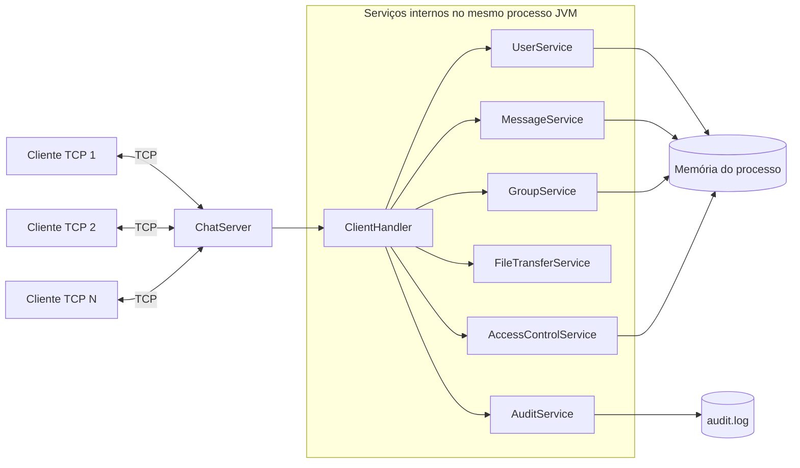
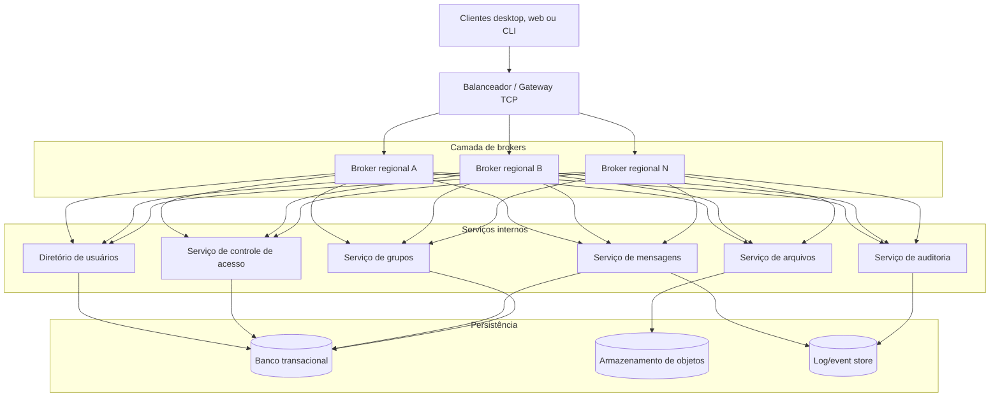
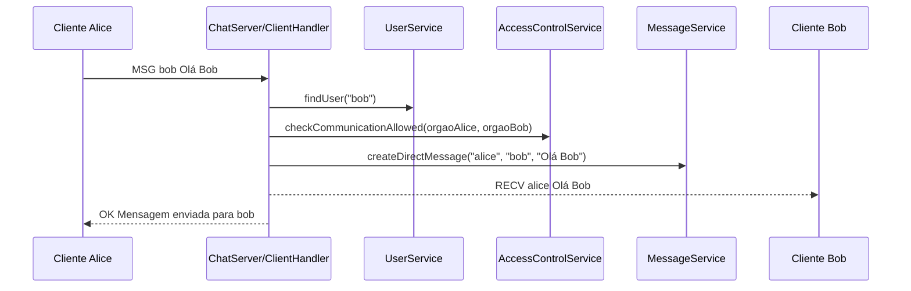

# Documento de Arquitetura do MVP

Projeto: Chat Corporativo Distribuído para Órgãos Públicos  
Disciplina: Sistemas Distribuídos  
Versão: 1.0  
Data: 2026-08-05  
Equipe: Diego Henrique Nakaniwa Ortiz, Fabio Ventura Lima, Gabriel Soares Ribeiro, Maria Eduarda Maia Pereira, Wagner Kenhiti Nakamura, 

## 1. Objetivo do documento

Este documento descreve a arquitetura do MVP do projeto de comunicação corporativa nacional proposto para órgãos e autarquias de uma federação fictícia com mais de 30 estados. O objetivo é registrar a solução de maneira suficientemente clara para permitir sua continuidade por uma segunda equipe, sem dependência de conhecimento tácito dos autores originais.

O repositório atual implementa uma prova de conceito (PoC) em Java baseada em sockets TCP e protocolo de aplicação próprio. Ao longo deste documento, os requisitos são tratados em duas perspectivas:

- `PoC atual`: o que já existe no código-fonte deste repositório.
- `MVP documentado`: a evolução arquitetural recomendada para atender integralmente aos requisitos da avaliação.

## 2. Escopo do sistema

O sistema proposto substitui plataformas internacionais de comunicação por uma alternativa nacional com foco em soberania digital, segurança, rastreabilidade e escalabilidade. O escopo funcional inclui:

- identificação única de usuários e grupos;
- troca de mensagens privadas;
- comunicação em grupos;
- envio de arquivos;
- aplicação de restrições de comunicação entre órgãos;
- trilha de auditoria;
- manutenção de histórico de mensagens.

## 3. Arquitetura adotada

### 3.1 Visão arquitetural do MVP

Para o MVP, recomenda-se uma arquitetura `cliente-servidor distribuída em camadas`, com brokers de comunicação horizontalmente escaláveis, serviços internos especializados e persistência externa. Essa escolha atende melhor aos requisitos de expansão geográfica, alta concorrência e separação entre autenticação, roteamento, auditoria e armazenamento.

### 3.2 Visão arquitetural da PoC atual

O repositório implementa uma versão simplificada `cliente-servidor centralizada`, com um único processo servidor, múltiplas conexões concorrentes e serviços em memória:

### 3.3 Visão arquitetural alvo para evolução

## 4. Componentes e responsabilidades

### 4.1 Componentes existentes na PoC

| Componente | Responsabilidade principal | Interfaces/métodos relevantes |
| --- | --- | --- |
| `ServerMain` | Inicializa o servidor na porta `5000` | `main` |
| `ChatServer` | Aceita conexões TCP, cria `ClientHandler`, registra clientes conectados e compartilha serviços | `start`, `stop`, `registerClient`, `unregisterClient`, `getClient`, `getConnectedUsers`, `isOnline` |
| `ClientHandler` | Controla a sessão de um cliente, interpreta comandos e delega ao serviço adequado | `run`, `sendMessage`, `getRawOutput` |
| `CommandParser` | Converte uma linha textual do protocolo em um objeto estruturado | `parse` |
| `UserService` | Autenticação, auto-registro e busca de usuários | `authenticate`, `findUser`, `listAllUsers`, `exists` |
| `MessageService` | Criação de mensagens diretas e de grupo, além do histórico em memória | `createDirectMessage`, `createGroupMessage`, `getDirectHistory`, `getGroupHistory` |
| `GroupService` | Criação, ingresso, saída e verificação de membros de grupos | `createGroup`, `joinGroup`, `leaveGroup`, `getGroup`, `getMembers`, `listGroups`, `isMember` |
| `FileTransferService` | Recebimento e envio de bytes de arquivos pelo socket | `receiveFileData`, `sendFileData` |
| `AccessControlService` | Verificação de autenticação e restrições entre órgãos | `blockCommunication`, `unblockCommunication`, `checkCommunicationAllowed`, `requireAuthentication`, `getBlockedPairs` |
| `AuditService` | Registro de auditoria em arquivo texto append-only no nível do processo | `logAction`, `close` |
| `User`, `Group`, `Message` | Modelos de domínio | getters e regras simples de integridade |

### 4.2 Componentes recomendados para o MVP distribuído

| Componente | Responsabilidade no MVP | Observação |
| --- | --- | --- |
| Gateway TCP | Terminação de conexões, rate limiting e encaminhamento para brokers | Pode ser TCP puro ou TCP + TLS |
| Broker de sessão | Manter sessões ativas, autenticar, rotear mensagens e coordenar respostas | Evolui o papel atual de `ChatServer` + `ClientHandler` |
| Diretório de usuários | Cadastro, autenticação, pesquisa e metadados de presença | Hoje está embutido em `UserService` |
| Serviço de grupos | Regras de ingresso, papéis e mensagens institucionais/privadas | Evolui `GroupService` |
| Serviço de ACL | Regras entre órgãos, grupos e perfis | Evolui `AccessControlService` |
| Serviço de mensagens | Persistência, ordenação, entrega, retry e histórico | Evolui `MessageService` |
| Serviço de arquivos | Upload, download, checksum e antivírus | Evolui `FileTransferService` |
| Serviço de auditoria | Eventos imutáveis, retenção e consulta | Evolui `AuditService` |

## 5. Protocolos de transporte e de aplicação

### 5.1 Transporte

- `PoC atual`: TCP sobre IPv4/IPv6, conexões persistentes ponto a ponto entre cliente e servidor.
- `MVP documentado`: TCP com TLS obrigatório para confidencialidade e autenticação do servidor.

### 5.2 Protocolo de aplicação

O protocolo da PoC é textual, orientado a linha, em UTF-8. Cada comando do cliente é enviado em uma linha. Em transferências de arquivo, após a linha de comando são enviados bytes brutos do arquivo.

#### Comandos do cliente para o servidor

| Comando | Sintaxe | Finalidade |
| --- | --- | --- |
| `LOGIN` | `LOGIN <usuario> <senha> <orgao>` | autenticar ou registrar automaticamente o usuário |
| `MSG` | `MSG <destinatario> <texto...>` | enviar mensagem direta |
| `GMSG` | `GMSG <grupo> <texto...>` | enviar mensagem ao grupo |
| `LIST` | `LIST` | listar usuários conectados |
| `GLIST` | `GLIST` | listar grupos cadastrados |
| `GCREATE` | `GCREATE <nomeGrupo>` | criar grupo |
| `GJOIN` | `GJOIN <grupo>` | entrar em grupo |
| `GLEAVE` | `GLEAVE <grupo>` | sair de grupo |
| `FILE` | `FILE <destinatario> <nomeArquivo> <tamanhoBytes>` | iniciar envio de arquivo |
| `QUIT` | `QUIT` | encerrar a sessão |

#### Respostas e eventos do servidor para o cliente

| Resposta | Sintaxe | Significado |
| --- | --- | --- |
| `OK` | `OK <mensagem>` | operação concluída com sucesso |
| `ERR` | `ERR <codigo> <mensagem>` | operação rejeitada |
| `RECV` | `RECV <remetente> <texto>` | mensagem direta recebida |
| `GRECV` | `GRECV <grupo> <remetente> <texto>` | mensagem de grupo recebida |
| `FRECV` | `FRECV <remetente> <arquivo> <tamanhoBytes>` | cabeçalho de recebimento de arquivo; em seguida chegam os bytes do arquivo |

#### Códigos de erro

| Código | Significado |
| --- | --- |
| `400` | argumentos inválidos |
| `401` | autenticação obrigatória |
| `402` | usuário já logado |
| `403` | acesso negado |
| `404` | usuário ou grupo não encontrado |
| `405` | comando desconhecido |
| `500` | erro interno |

### 5.3 Exemplo de fluxo de mensagem direta

## 6. Modelo de comunicação

O sistema combina mais de um estilo de comunicação:

- `síncrono` para comandos do cliente (`LOGIN`, `LIST`, `GCREATE`, `QUIT`);
- `assíncrono com push do servidor` para entrega de mensagens recebidas por outro usuário;
- `orientado a mensagem` para conversas privadas e de grupo;
- `publicar/assinar simplificado` para grupos, em que o emissor publica para um grupo e o broker entrega a todos os membros online;
- `streaming binário` para arquivos, usando a mesma conexão TCP após o comando `FILE`.

Na PoC, toda a comunicação passa por um único broker. No MVP, o mesmo modelo deve ser preservado, mas distribuído entre brokers regionais com descoberta de sessão e persistência compartilhada.

## 7. Interfaces entre módulos

### 7.1 Interfaces internas na PoC

As interfaces internas são chamadas diretas entre objetos Java no mesmo processo. O ponto central é o `ClientHandler`, que atua como orquestrador da sessão.

| Origem | Destino | Operação | Efeito |
| --- | --- | --- | --- |
| `ClientHandler` | `UserService` | `authenticate` | autentica ou registra usuário |
| `ClientHandler` | `UserService` | `findUser` | valida existência de destinatário |
| `ClientHandler` | `MessageService` | `createDirectMessage` | registra mensagem privada |
| `ClientHandler` | `MessageService` | `createGroupMessage` | registra mensagem de grupo |
| `ClientHandler` | `GroupService` | `createGroup`, `joinGroup`, `leaveGroup`, `getMembers` | gerencia grupos |
| `ClientHandler` | `AccessControlService` | `requireAuthentication`, `checkCommunicationAllowed` | aplica regras de acesso |
| `ClientHandler` | `FileTransferService` | `receiveFileData`, `sendFileData` | transfere arquivo |
| `ClientHandler` | `AuditService` | `logAction` | registra auditoria |
| `ChatServer` | `ClientHandler` | `sendMessage` | entrega evento a cliente online |

### 7.2 Interfaces recomendadas para o MVP distribuído

No MVP distribuído, as mesmas responsabilidades podem ser externalizadas como serviços internos com contratos estáveis. Uma opção é expor essas interfaces via RPC interno:

| Serviço | Operações mínimas |
| --- | --- |
| Diretório de usuários | `AuthenticateUser`, `FindUser`, `SearchUsers`, `SetPresence`, `GetPresence` |
| Controle de acesso | `CanCommunicate`, `CanJoinGroup`, `CanPostToGroup`, `BlockOrgPair`, `UnblockOrgPair` |
| Grupos | `CreateGroup`, `AddMember`, `RemoveMember`, `ListGroups`, `ListMembers` |
| Mensagens | `PersistDirectMessage`, `PersistGroupMessage`, `LoadConversation`, `LoadGroupHistory`, `PublishEnvelope` |
| Arquivos | `InitiateUpload`, `StoreChunk`, `FinalizeUpload`, `ReadMetadata`, `OpenDownload` |
| Auditoria | `AppendAuditEvent`, `ReadAuditTrail` |

## 8. Modelo de dados e identificação

### 8.1 Identidade

- Usuário: identificado de forma única pelo `username`.
- Grupo: identificado de forma única pelo `name`.
- Órgão/autarquia: atributo associado ao usuário para aplicação de ACLs.

### 8.2 Entidades da PoC

| Entidade | Campos principais | Observação |
| --- | --- | --- |
| `User` | `username`, `password`, `orgao` | senha fica em texto simples em memória na PoC |
| `Group` | `name`, `owner`, `members`, `isPrivate` | membros armazenados em `ConcurrentHashMap.newKeySet()` |
| `Message` | `sender`, `receiver/groupName`, `content`, `timestamp` | ordenação atual é apenas temporal local |

### 8.3 Modelo recomendado para causalidade no MVP

Para cumprir integralmente o requisito de histórico com ordem causal e múltiplos dispositivos, cada mensagem do MVP deve incluir:

- `messageId` global;
- `conversationId` ou `groupId`;
- `senderUserId`;
- `senderDeviceId`;
- `serverSequence`;
- `vectorClock` ou dependências causais equivalentes;
- `timestampCliente` e `timestampServidor`;
- `hashIntegridade`.

Na PoC atual, o histórico é apenas em memória, com `LocalDateTime.now()`, sem vetor de causalidade, persistência ou sincronização entre dispositivos.

## 9. Transparências do sistema

### 9.1 Transparência de acesso

Presente de forma parcial. O cliente usa o mesmo conjunto de comandos independentemente do destinatário ou grupo. No entanto, o protocolo ainda exige que o cliente conheça a sintaxe textual e não existe SDK oficial.

### 9.2 Transparência de localização

Parcial. O usuário final se comunica por identificadores lógicos (`username`, `groupName`) sem conhecer o socket do destinatário. Por outro lado, ainda precisa conhecer manualmente o endereço do servidor.

### 9.3 Transparência de concorrência

Presente no nível básico. O servidor aceita múltiplos clientes simultâneos com `ExecutorService` e estruturas `ConcurrentHashMap`. Ainda assim, não há isolamento transacional nem coordenação distribuída de concorrência.

### 9.4 Transparência de replicação

Ausente na PoC. Todos os dados ficam em um único processo e não há réplicas. No MVP, deve existir replicação do diretório, histórico, auditoria e estado de sessão.

### 9.5 Transparência a falhas

Parcial. O servidor detecta desconexões por exceção de socket ou fim de fluxo, mas não possui retry, reconexão, failover ou recuperação de mensagens offline.

## 10. Escalabilidade horizontal e vertical

### 10.1 Escalabilidade vertical

O desenho atual escala verticalmente com:

- aumento de CPU e memória da JVM;
- ajuste do tamanho de heap;
- eventual troca de `newCachedThreadPool` por pool com limites e fila;
- otimização do tamanho máximo de arquivo.

Essa abordagem é suficiente para o laboratório e para uma PoC de baixa escala, mas não para um cenário federativo nacional.

### 10.2 Escalabilidade horizontal

Para suportar crescimento orgânico e expansão geográfica, o MVP deve evoluir para:

- múltiplos brokers de sessão atrás de balanceador;
- particionamento por região, órgão ou hash de usuário;
- persistência externa compartilhada;
- replicação do log de auditoria;
- armazenamento de arquivos fora do processo do broker;
- cache distribuído para presença e resolução de sessão;
- filas internas para desacoplamento entre auditoria, persistência e entrega.

### 10.3 Justificativa da arquitetura

A arquitetura distribuída em camadas foi escolhida porque:

- reduz o acoplamento entre transporte, domínio e persistência;
- permite escalar mensagens, arquivos e auditoria de maneira independente;
- favorece implantação geograficamente distribuída;
- facilita atendimento futuro de requisitos de conformidade e soberania digital.

## 11. Falhas, detecção, prevenção e recuperação

### 11.1 Detecção

- `PoC atual`: exceções de I/O, desconexão detectada por `readLine() == null`, erros de parsing e validação.
- `MVP documentado`: health checks, métricas de latência, heartbeat de sessão, circuit breaker e monitoramento de backlog.

### 11.2 Prevenção

- validação de autenticação antes de operações sensíveis;
- verificação de existência de usuários e grupos;
- restrições de comunicação entre órgãos;
- limite de 10 MB por arquivo na PoC;
- trilha de auditoria por evento.

### 11.3 Recuperação

- `PoC atual`: reinício manual do processo; estado em memória é perdido; `audit.log` é preservado.
- `MVP documentado`: restauração automática do estado a partir de armazenamento durável, reprocessamento de eventos, retry de entrega e mecanismo de fila para usuários offline.

### 11.4 Alta disponibilidade

Não existe alta disponibilidade real na PoC, pois há ponto único de falha. Para o MVP, recomenda-se:

- brokers em modo ativo-ativo;
- persistência replicada;
- armazenamento de auditoria imutável e redundante;
- failover entre zonas de disponibilidade;
- balanceamento com drenagem de conexões em manutenção.

## 12. Segurança

### 12.1 Autenticidade

- `PoC atual`: autenticidade baseada apenas em `username + senha`, validada pelo `UserService`.
- `Limitação`: não há assinatura de mensagens nem prova de integridade de arquivo.
- `MVP recomendado`: TLS, senha com hash forte, tokens de sessão, assinatura/HMAC por mensagem e checksum de arquivo.

### 12.2 Não repúdio

- `PoC atual`: existe `audit.log` com data, usuário, ação e detalhes.
- `Limitação`: o log não é imutável nem assinado digitalmente.
- `MVP recomendado`: trilha append-only com carimbo do tempo confiável, retenção, versionamento e assinatura institucional.

### 12.3 Confidencialidade

- `PoC atual`: não atendida integralmente; o tráfego ocorre em texto claro sobre TCP.
- `MVP recomendado`: TLS ponta a servidor, criptografia em repouso e controle de acesso por perfis e órgãos.

## 13. Aderência aos requisitos da avaliação

| ID | Requisito | Situação no PoC atual | Direcionamento do MVP |
| --- | --- | --- | --- |
| `R01` | Arquitetura distribuída especificada | parcialmente atendido pelo código; detalhado neste documento | expandir para múltiplos brokers e persistência externa |
| `R02` | Protocolos de aplicação e transporte | atendido | manter TCP e adicionar TLS |
| `R03` | Modelo de comunicação | atendido parcialmente | consolidar assíncrono com entrega persistente |
| `R04` | Interfaces entre módulos | atendido neste documento | externalizar serviços internos em RPC interno |
| `R05` | Funções, métodos e serviços expostos | atendido neste documento | manter contratos estáveis por serviço |
| `R06` | Tipos de transparência | atendido neste documento | ampliar replicação e falhas |
| `R07` | Escalabilidade horizontal e vertical | parcialmente atendido | distribuir brokers, estado e storage |
| `R08` | Tolerância a falhas e alta disponibilidade | parcialmente atendido | replicação, failover e replay |
| `R09` | Identificação única de usuários e grupos | atendido | manter unicidade com persistência transacional |
| `R10` | Mensagens entre usuários | atendido | manter com persistência e offline delivery |
| `R11` | Busca por usuários cadastrados | parcialmente atendido; existe `listAllUsers`, mas o protocolo expõe apenas `LIST` de usuários online | adicionar busca e listagem de usuários registrados |
| `R12` | Envio de arquivos | atendido parcialmente; apenas para destinatário online | persistir arquivo e permitir download posterior |
| `R13` | Comunicação em grupos privados ou institucionais | parcialmente atendido | incluir criação de grupo privado/institucional e papéis |
| `R14` | Restrições entre órgãos/autarquias | parcialmente atendido; regra existe, mas não há comando administrativo no protocolo | externalizar ACL com interface de gestão |
| `R15` | Restrições de ingresso em grupos | parcialmente atendido | workflow de convite/aprovação |
| `R16` | Restrições de comunicação entre membros de grupos | parcialmente atendido; somente membros podem receber/enviar no grupo | incluir ACL por grupo, papel e canal |
| `R17` | Histórico completo com ordem causal e multi-dispositivo | não atendido integralmente | persistência durável, sincronização e causalidade |
| `R18` | Autenticidade de mensagens e arquivos | parcialmente atendido | assinatura/HMAC e identidade forte |
| `R19` | Não repúdio | parcialmente atendido | auditoria imutável e assinada |
| `R20` | Confidencialidade | não atendido integralmente | TLS e criptografia em repouso |
| `R21` | Desempenho e escalabilidade | parcialmente atendido | distribuição por região, filas e storage externo |

